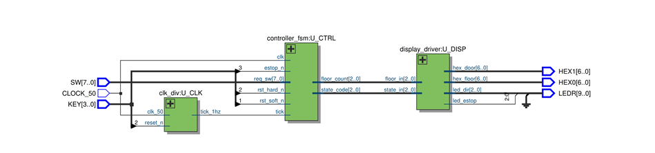
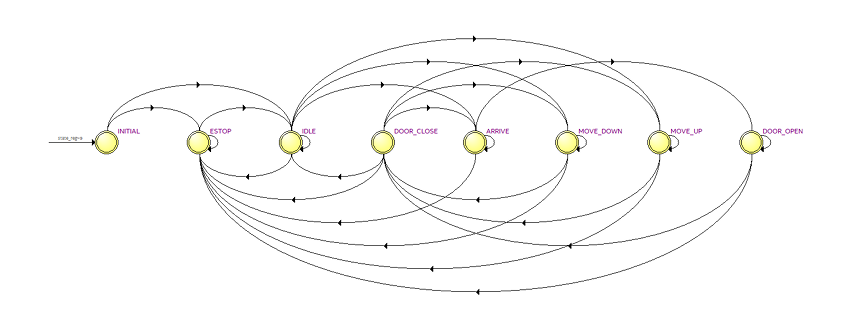

<h1>FPGA Elevator Controller (VHDL)</h1>

<h2>📌 Overview</h2>

This project implements a fully digital elevator controller using VHDL on an FPGA.
The system simulates real-world elevator behavior including request handling, scheduling,
floor tracking, door control, and emergency stop functionality.

The design is built around a modular architecture with a central finite state machine (FSM),
a clock divider for timing control, and a display driver for real-time status output.

---

<h2>⚙️ System Features</h2>

<ul>
  <li>Finite State Machine (Moore-based design)</li>
  <li>Up/down sweep scheduling algorithm</li>
  <li>Request latching with debouncing logic</li>
  <li>Simulated travel and door timing using counters</li>
  <li>Emergency stop and reset handling</li>
  <li>7-segment display and LED status output</li>
</ul>

---

<h2>🧠 Architecture</h2>

The system is composed of three main modules:

<ul>
  <li><b>controller_fsm</b> – Handles elevator logic, scheduling, and state transitions</li>
  <li><b>clk_div</b> – Converts 50 MHz clock into a 1 Hz timing tick</li>
  <li><b>display_driver</b> – Controls LEDs and 7-segment displays</li>
</ul>

  

---

<h2>🔄 Finite State Machine</h2>

The elevator operates using a deterministic FSM with states such as:
INITIAL, IDLE, MOVE_UP, MOVE_DOWN, ARRIVE, DOOR_OPEN, DOOR_CLOSE, and ESTOP.

  

---

<h2>📥 Inputs / Outputs</h2>

<h3>Inputs</h3>
<ul>
  <li>SW[7:0] – Floor requests</li>
  <li>KEY[3] – Emergency stop (active low)</li>
  <li>KEY[2] – Hard reset</li>
  <li>KEY[1] – Soft reset</li>
  <li>CLOCK_50 – 50 MHz system clock</li>
</ul>

<h3>Outputs</h3>
<ul>
  <li>HEX0 – Current floor display</li>
  <li>HEX1 – Door / state indicator</li>
  <li>LEDR[2:0] – Direction indicators</li>
  <li>LEDR[9] – Emergency stop indicator</li>
</ul>

---

<h2>⏱️ Timing Parameters</h2>

<ul>
  <li>Floor travel time: 2 seconds</li>
  <li>Door open time: 2 seconds</li>
  <li>Arrival delay: 2 seconds</li>
  <li>8-floor system (expandable)</li>
</ul>

---

<h2>📊 Design Highlights</h2>

<ul>
  <li>Moore FSM chosen for safe, deterministic outputs</li>
  <li>Modular architecture for scalability and debugging</li>
  <li>Synchronous design using clock division</li>
  <li>Fully simulated before hardware deployment</li>
</ul>

---

<h2>📁 Repository Structure</h2>

<pre>
/vhdl
  ├── elevator_top.vhd
  ├── controller_fsm.vhd
  ├── clk_div.vhd
  ├── display_driver.vhd

/images
  ├── block_diagram.png
  ├── fsm_diagram.png

/docs
  ├── elevator_report.pdf
</pre>

---

<h2>📄 Full Documentation</h2>

A full technical report is available in the repository, including:
FSM design, timing analysis, architecture breakdown, and testbench verification.

<a href="./docs/elevator_report.pdf">📥 View Full Report (PDF)</a>

---

<h2>👨‍💻 Contributors</h2>

<ul>
  <li>Matthew Wong</li>
  <li>Ayden Lee</li>
  <li>Darren Zhao</li>
</ul>
